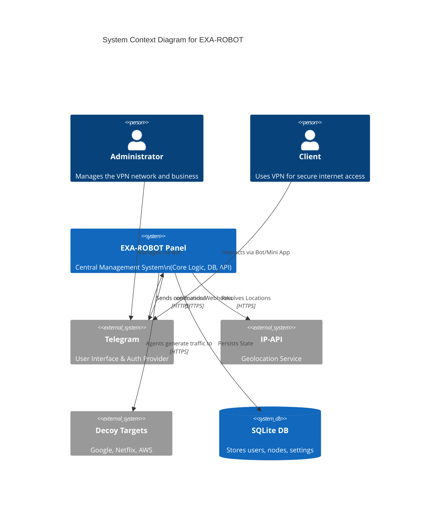

# C4 Context: EXA-ROBOT System

## System Overview

### Short Description
EXA-ROBOT is a Telegram-integrated VPN management system that automates server deployment, user subscription management, and intelligent traffic routing.

### Long Description
EXA-ROBOT solves the problem of complex VPN management by providing a "Headless" architecture where the primary interface is a Telegram Bot and Mini App. It manages a distributed network of "Agents" (VPN nodes) controlled by a central "Panel". It handles user authentication, subscription billing, traffic shaping, decoy traffic generation for censorship resistance, and AI-powered route optimization.

## Personas

### Administrator
- **Type**: Human User
- **Description**: The owner of the VPN service.
- **Goals**: Manage servers, monitor network health, configure pricing, and oversee the user base.
- **Key Features Used**: Admin Dashboard, Telegram Admin Commands, Server Statistics, User Management.

### Client (User)
- **Type**: Human User
- **Description**: A subscriber looking for secure and fast internet access.
- **Goals**: Connect to VPN, check balance, extend subscription, and get support.
- **Key Features Used**: Telegram Bot, Mini App, Subscription Link generation (Clash/V2Ray).

### Agent (Node)
- **Type**: Programmatic User (Daemon)
- **Description**: A remote server running the `exarobot-agent` binary.
- **Goals**: Report health, pull configuration, enforcement traffic rules, and route packets.
- **Key Features Used**: Heartbeat API, Telemetry, Config Pull.

## System Features

### Subscription Management
- **Description**: Automated creation, expiration, and renewal of VPN credentials based on payment status.
- **Users**: Client, Administrator.

### AI Route Optimization
- **Description**: dynamically calculates the best node for a user based on distance, latency, and server load.
- **Users**: Client (via API/Mini App).

### Decoy Traffic Generation
- **Description**: Generates fake traffic to reputable sites to mask VPN usage patterns.
- **Users**: Agent (Internal).

## External Systems and Dependencies

### Telegram Bot API
- **Type**: External Service
- **Description**: The primary user interface platform.
- **Integration Type**: HTTPS API (Webhooks/Polling).
- **Purpose**: User interaction, authentication, notifications.

### IP-API.com
- **Type**: External API
- **Description**: Geolocation service.
- **Integration Type**: HTTP REST.
- **Purpose**: Resolving user and node IP addresses to physical locations for routing optimization.

### Decoy Targets (Google, Netflix, Azure)
- **Type**: External Systems
- **Description**: High-reputation websites.
- **Integration Type**: HTTP Requests.
- **Purpose**: Destinations for generated decoy traffic to blend in with normal web browsing.

## System Context Diagram

## Related Documentation
- [API Reference](./api_reference.md)
- [Project Map](./project_map.md)
